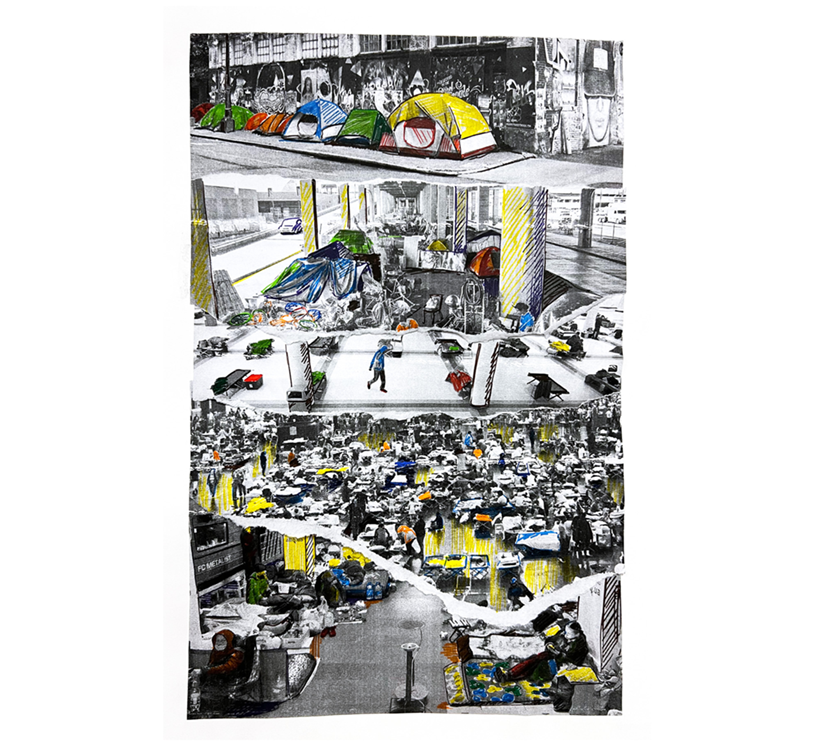
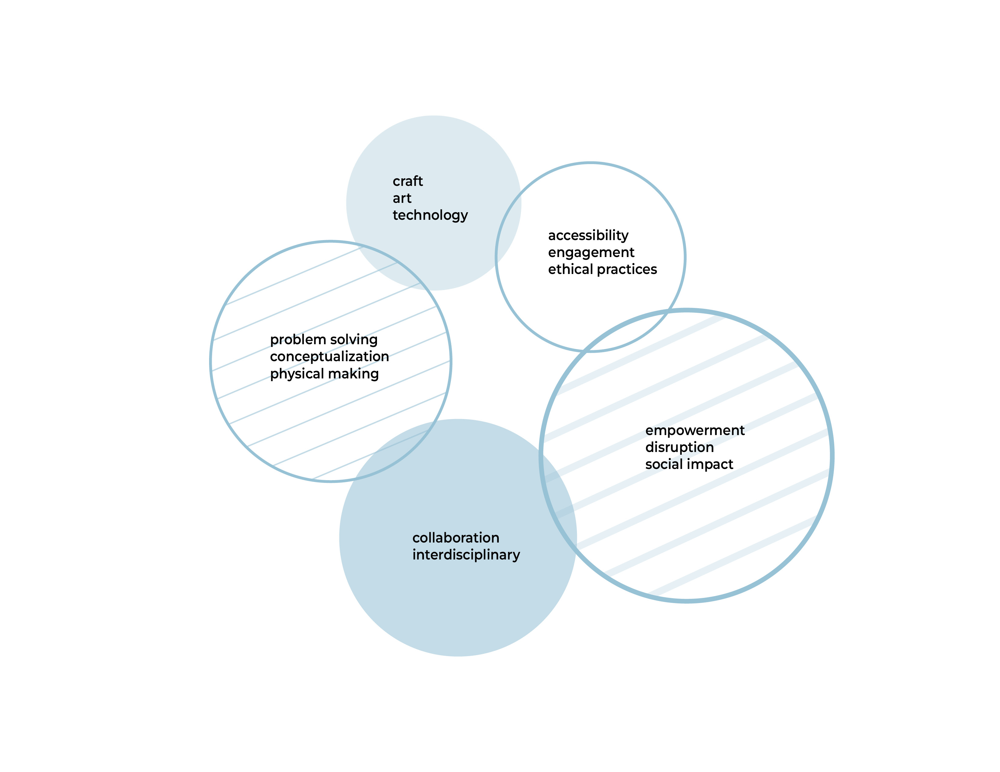
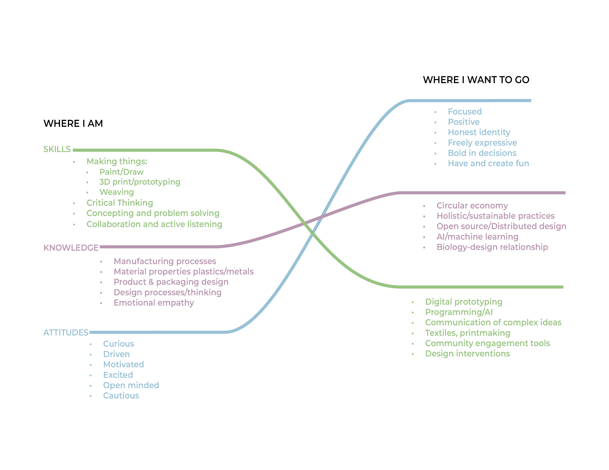
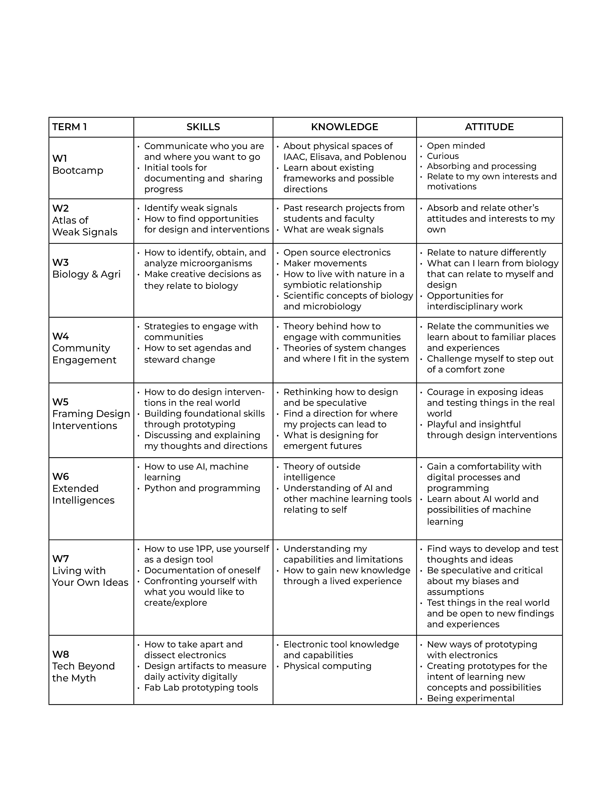

---
hide:
    - toc
---

# Bootcamp

Bootcamp assignments 10.7.2022

##   What is my fight?
#### An issue in the world that motivates me is the topic of displaced peoples due to the lack of affordable housing, natural disasters, health crisis, war, and political strife. In an instance a group of people can completely lose their home, leaving them in a vulnerable state and depending on others for basic necessities. On the poster I have examples of situations from my city in Seattle, (WA, U.S.), emergency shelters during Covid, hurricane relief, and subways as a bomb shelter for war.
#### My personal connection to this topic is from living in cities where this is a rising issue and for my undergraduate thesis project I looked at addressing the needs of unhoused people in Ohio in the U.S. In this project I worked with a homeless community and service providers. I sought to understand how information about services could be shared more efficiently to help people’s unique situations rather than a one-fits-all solution. This is a broad and complex issue that relates to climate change and sustainability. 
#### I would like to learn more about holistic community engagement tools that can give empowerment to local communities. I am also interested in looking beyond the physical object as a solution.

