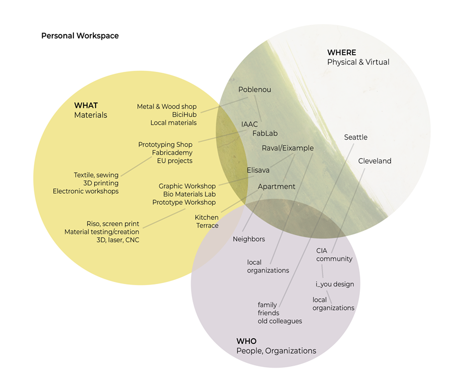
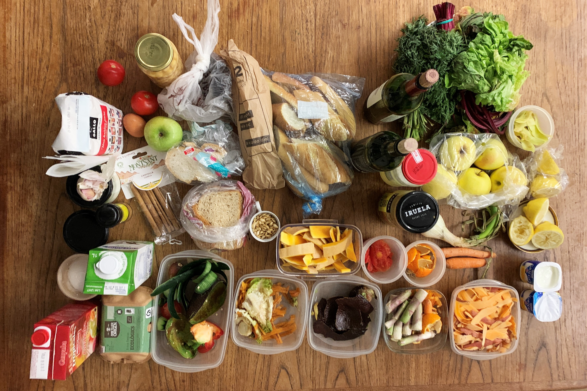
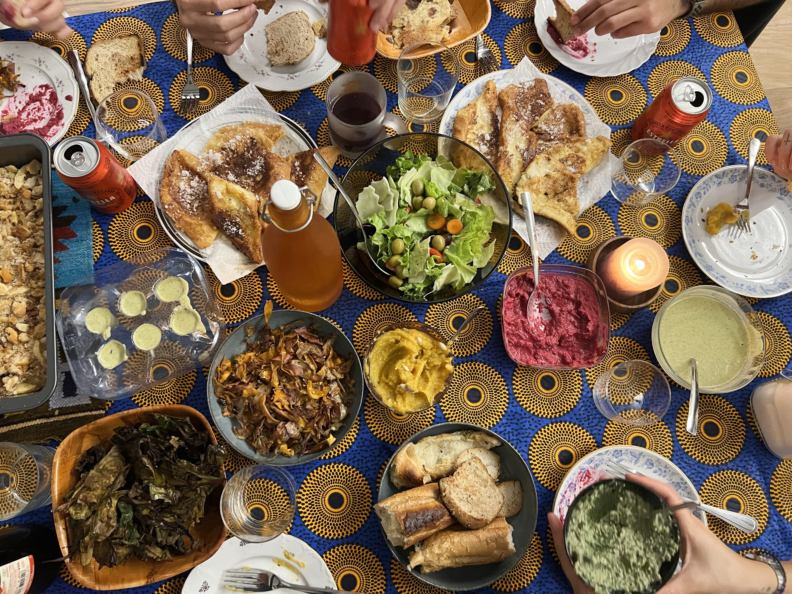

---
hide:
    - toc
---

# Design Studio: Framing Design Interventions

### Roles of Prototyping

*Which types of prototypes have you used and for what purposes?*

I have used the first and third types of prototypes the most –prototype as an experimental component and prototype as a research archetype. I have prototyped as an experimental component to test ergonomics and physical feasibility through frankenstein mock ups of a variety of materials such as 3d prints, wood, foam, metals, or scrap parts. These are to test the basic shape, scale, function, and look of an object for product design purposes. These prototypes were to test a hypothesis about if a concept was feasible, for example, if a specific shape of a container could preserve vegetables in the fridge 
longer. Or if a certain length or orientation of a handle made it easier or harder to be used. 

Prototype as a research archetype was used by creating prototypes that showed the possibility of a concept that was yet to exist. For example, mocking up 3D prints to appear like metal, plastic or fabric thicknesses and seeing how parts could be combined or mixed and matched. Or a medical boot 
concept from renderings and cardboard prototypes, which mocked up a new way of customizing your own medical boot using a moldable plastic. 

*Which ones haven’t you used and how do you think they could be interesting for you?*

The second or fourth types I have used the least –prototype as a means of inquiry and the process of prototyping as a vehicle for inquiry. The second type will be interesting to create ways to collect types of data. Such as some type of technology or empathy probe that can create a reaction that is measured. By measuring an emotional connection, it can give a more holistic idea to how a hypothesis is being encountered. As well as showing how people are being transformed by an experience or object. The fourth type is interesting to see how the process itself can be analyzed by showing how something was created, by documenting the journey and research behind an artifact. 

*What are the main roles of prototyping, combinations of them and other design activities that you want to use?*

I would like to start with the third and fourth types of prototyping, to gather insight on my research direction and to document the process of inquiry. I would like to continue to use prototype four with the other three types to continue to document throughout different stages. I would use prototype two and one to test specific hypotheses and to ask and gather information through interviews and 
questionnaires. 

### Personal Workspace

### Communication Strategy 

Below are the communication strategies I am planning for:

Open Design Processes:

- Understand your audience:

As a first step, I am looking to continue interviewing people that may relate to my interests and project, through faculty and MDEF connections. I want to understand what is currently happening in Barcelona, past projects, and learn from people working in similar fields. I am also engaging in local events that relate to waste and volunteering with current groups providing services for underserved communities. 

- Experiential prototypes & compiling material samples: 

As part of my process I will start to experiment with materials and resources that I find interesting and take photos and videos of my process. Currently I am interested in craft and sustainable materials. There is a lot of biomaterial research that I am open to exploring, as it is a new area of interest for me. I am also interested in textiles and will start my own personal textile project to get into a creative mindset that is not pressured by school or income, but could spark future ideas.

Communication Medium:

- Graphics or drawings to understand the process and concept:

I plan to map my interests and connections as they continue to evolve. I will physically draw out these maps to have a visual representation of my thought process.

- Social media presence to document and show process and journey:

I will use social media as a way to document and share my MDEF journey through stories, reels and posts. I would like to eventually build an identity that is accessible to past colleagues and designers as a way to engage with current industry, but that also shows my work and development. 

### Collective Design Intervention

As the Hack the Supply Chain group we made our first intervention by cooking a dinner together using collected food waste scraps. This started because we were curious about why we value parts of a vegetable or fruit as “waste” and wondered what we could create out of this so-called “waste.” For a week we each saved up our peels, stale bread, wilting fruits and vegetables. 

We each picked a recipe to make and cooked them simultaneously. By cooking together we were able to improvise, and collaborate on the recipes together. Some dishes followed an exact recipe, while others changed depending on what ingredients we had and the motivation to use as much of it as possible. We were all surprised at how much food we ended up making and that we were able to use almost everything we brought. We were also surprised with how good everything looked and tasted.

This first intervention was a good way to start testing out a question. Even though we weren’t all interested in food specifically, it was something universal that could be related to by everyone. It helped to bring up other questions that relate to supply chains and society’s conditioning. Such as, how we were taught about what to throw away and what to keep, what expiration dates really mean, and how packaging could be improved.  

Here are images from before, and after cooking:

