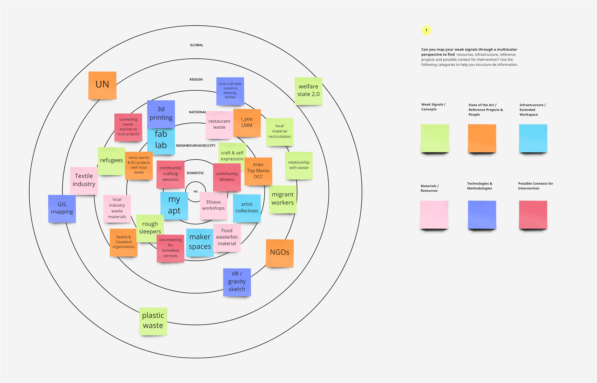

---
hide:
    - toc
---

# Atlas of Weak Signals

### Design Space

### Multiscalar Space

My main weak signals are Welfare State 2.0 and Climate Conscience. For each one I have branches of triggers that break my specific interests down and relate to one another. As well as articles of examples that could be possible opportunities. To me Welfare State 2.0 means the general well being of citizens and what the future looks like for people on the margins of society. What does it look like for equality of all peoples, genders, ages, races. I chose the second card, Climate Conscience, because I also want to relate to sustainability of the planet and how we use resources, materials, and live among nature. 

My design space is currently a brainstorm with general ideas at the top filtering to more specific ideas below. For Welfare State 2.0, I have the triggers: Wellness Tech, Food Apartheids, Nomadic Design, and Inclusivity Activism. My past experience has been working on projects related to unhoused peoples and seeing how resources can be accessible as well as finding ways to engage with people sleeping rough in cities. I also have some experience working with women and children from an indigenous group in Bolivia. I have other interests in prevention of food waste and have done many projects related to cooking and food prep. When living in Cleveland there were many food desserts that came along with gentrification and the segregation of societies. There are so many specific issues to address, but for now I would like to broaden my scope to looking at nomadic lifestyles and wellness. Although my background is in product design, I would like to explore alternative ways of designing a thoughtful way of improving some aspect of someone’s well being as relating to basic necessities. In terms of who, I am interested in working with women and children who are often overlooked. 

Within my second area of Climate Conscience I have the trigger cards: Craftivism and Local Materials Recirculation. My past experience is working a lot with manufacturing of plastics and metals. I have seen the unsustainable processes that go into making a product from start to finish and have a lot of knowledge about manufacturing. Using my knowledge of production cycles, I can see how new materials or alternative methods could be applied to have a sustainable outcome. I am interested in textiles and making things by hand in a way that teaches new skills. I have experience with weaving and sewing, and would like to learn other types of textile making. I think craftivism is a great gateway to looking at non-western centric futures, as each culture has its own techniques and practices. I am also interested in Local Materials Recirculation and local fabrication. I would like to learn about local materials and how they could be used to promote circular economy and recyclability.

There is an intersection of craft, local materials, and under-resourced communities that I would like to explore. There is a lot of existing work within each of these categories, and I would like to find opportunities to relate them to one another. 
