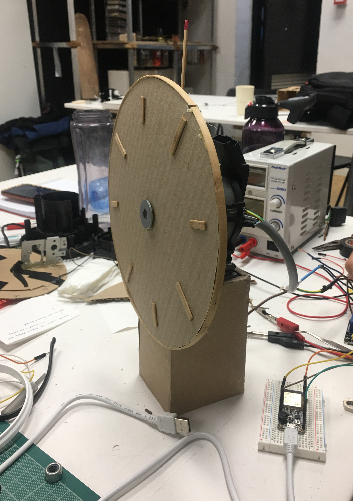

---
hide:
    - toc
---

# Tech Beyond the Myth

This week we learned about the right to repair, black boxes, how things are made, and how we can combine code with machines. We started with a forensic report of a broken item, and followed with creating an Almost Useful Machine. Below are presentations of each project followed by my reflection. 

### Forensic Report

We began the week choosing an item that had stopped working to disassemble. Our item was a Sports Blender by Electrolux, which was surprisingly difficult to take a part. Our findings can be found in the link below.

[Full Report](https://hackmd.io/s/HJBEvhPBo)

### Distracted Timer - Almost Useful Machine

After learning about motors from our broken blender, we used a windshield wiper motor to create a distracted timer. Using Arduino and sensors, we were able to make our almost useful machine. 

[Presentation](https://www.canva.com/design/DAFSGssYzEA/FqJPNQMS33QH5i-fKP5DVg/view?utm_content=DAFSGssYzEA&utm_campaign=designshare&utm_medium=link&utm_source=viewer)

Video

<iframe src="https://player.vimeo.com/video/775568171?h=7fd4306a9c&amp;badge=0&amp;autopause=0&amp;player_id=0&amp;app_id=58479" frameborder="0" allow="autoplay; fullscreen; picture-in-picture" allowfullscreen style="position:absolute;top:0;left:0;width:100%;height:100%;" title="DistractedTimer.mp4"></iframe>

Motor hooked up to Arduino 

Cardboard mockup

### Reflection

This week was very interesting for me because although I have taken a part and built products in industrial design, I am less familiar with electronics. Learning about AC vs. DC motors was new to me as well as working with Arduino. There was a steep learning curve to understand how we could control a motor using code. First was understanding how to make the motor run from a battery, and then learning how we could connect that power to Arduino for it to be controlled. Once we were able to map out how the electricity would flow it made a lot more sense and was a great way to visualize how energy flows from one element to another. It was also exciting to figure out how to make the motor turn different directions and brainstorm what else we could make it do. 

The topic of the right to repair is really interesting to me and from an industrial design perspective is something that gets pushed aside in the design process when it comes to cost of material and manufacturing. So many products are designed to work for a short period of time and do not give agency to the user when it comes to taking it a part and fixing it. Also with everything being encased in "black boxes" we are taught to make things look simple and seamless, when in fact that communicates to the user that they should not interfere with understanding how the product is working.

