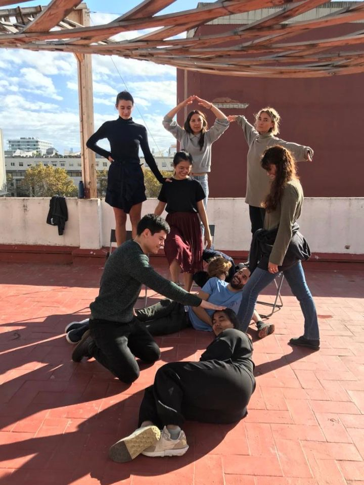
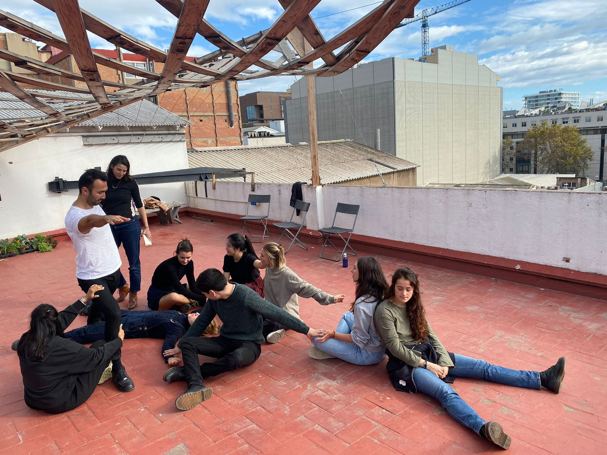
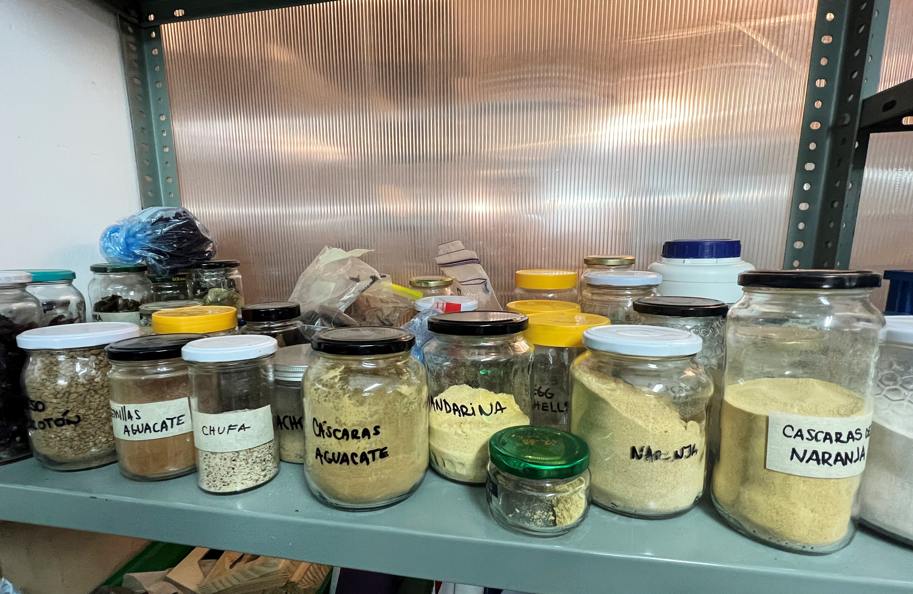
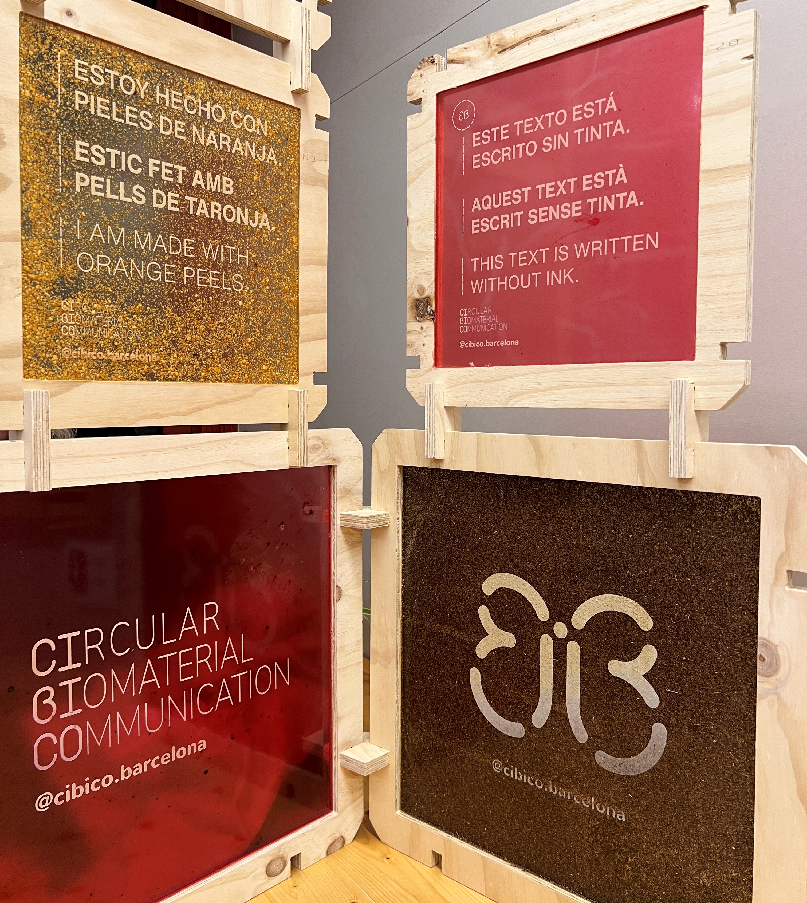
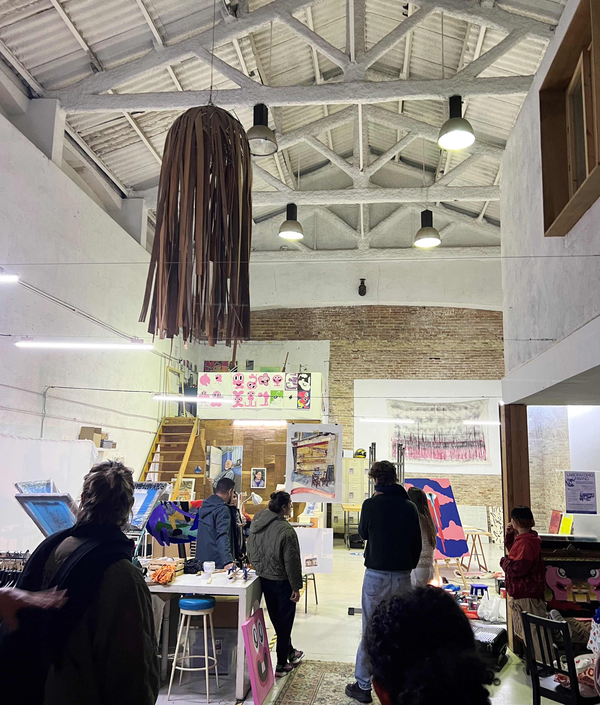

---
hide:
    - toc
---

# Community Engagement

### Reflection

This seminar for Community Engagement was helpful to see frameworks and examples for how to successfully facilitate workshops and approach communities to design with. It was helpful to think about how to practically work with stakeholders that have their own motivations and maneuver between a variety of perspectives and needs within a community project. We did a hypothetical role playing of stake holders that would work with a local building and residency. Acting out how each role would interact with each other, and understanding each role's needs and motivations. I enjoyed visiting local places in Poblenou that have created open spaces for artists and the surrounding neighborhood to collaborate. Two of the places we visited were working with food waste and biomaterials to make products, education, and designs. Poblenou has an interesting dynamic with the gentrification of tech, it was good to see artist spaces and organizations that are working to keep historical buildlings preserved and think about what role artists play in that preservation. 

### Intervention Outline

### 4D Model - Social Presencing Workshop
The following images are from our 4D map performing an embodiment of what "higher education" looks like. This was an exercise to map out the various components that make up a system and how they relate to each other. We did this exercise in silence and acted it out, it was interesting to see how we worked together and related to one another as we each made a pose of how we would embody that part of the system. 

First is a model on how we perceive the current system to be, and the second show show we would like it to be. Each of us played a different role in the system from institution, government, student, opportunity, access to money, research and more. 

### Poblenou Visits
We were able to visit local artist and maker spaces in Poblenou and learn about current community spaces in Poblenou. 

Samples from biomaterial lab and fabrication studio 

Biomaterial signage made from food, work done by @cibico.barcelona

Artist residency and space called La Escocesa
