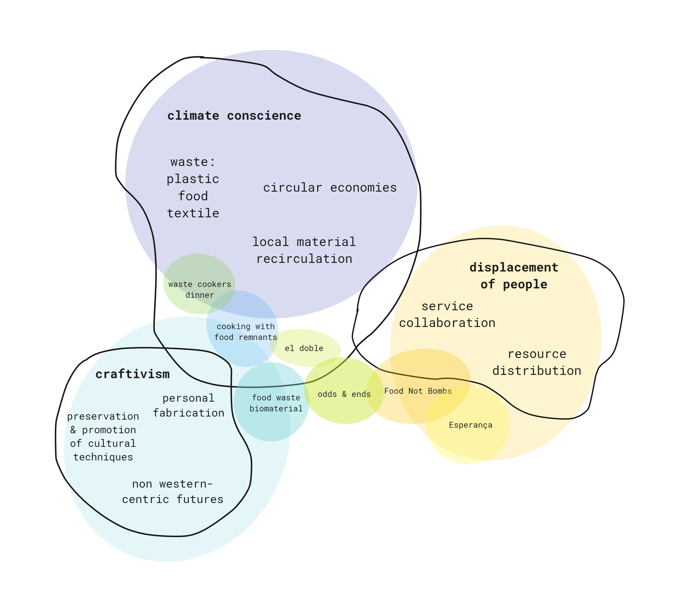
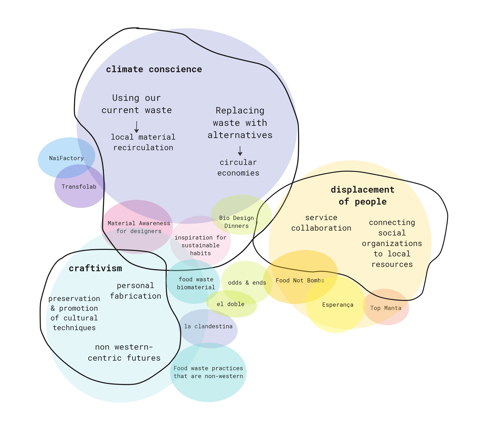

---
hide:
    - toc
---

# Design Studio II

### Updated Design Space

**Term 1 design space:**
This space was created at the end of Term 1, it shows connections and interventions during the first term. 

**Term 2 design space update:**
An updated design space as I enter into Term 2. Connections and topics I want to further explore in term 2. 

My design space shows three areas of interest: climate conscience, craftivism, and displacement of people. At the end of Term 1 my project was able to develop through working with others to create multiple interventions and explorations. The main focus was around waste, and specifically food waste. We approached this through collecting our own waste, questioning our relationship to it, and experimenting with what we could make out of it. After learning basic bioplastic and paper recipes, I learned the complexity of making a sustainable material. Food waste was accessible and relatable. We learned not only about biomaterials but it also made us rethink our eating habits and new food recipes. During design dialogues, I was able to talk with people about their interest in learning how to make their own materials from their waste and how they could cook recipes that would eliminate food waste. 

We also worked with local social organizations, Food Not Bombs and Esperanca. Both organizations use food as a way to connect. Food Not Bombs collects local grocery waste and turns it into community public dinners. Esperanca collaborates with people to share their cooking skills and serves food to people on the street on the weekends, a time where services are closed. 

I started the term motivated by my fight of finding new ways to approach the systemic and growing issue of displaced peoples, specifically people sleeping rough. With the complexity of this topic I felt like it was difficult to engage and understand the systems in Barcelona with the short amount of time. I was grateful to be able to connect briefly with the two organizations, and in Term 2 would like to find ways to connect organizations to each other and be a bridge between resources and services. I would like to find ways to have more open dialogue about my project so it can feel more connected to their context and have time to learn from their expertise. 

The rate in which waste is produced seems impossible to keep up with in how it can be addressed. I am interested in looking at both approaches to waste management. One being how we can use our current waste and give it a second life. From ocean plastics in the great pacific garbage patch, to garbage islands, there is an abundance of used material all around. The second approach is looking at alternatives to replace plastic and wasteful materials. This would include biodegradable and circular economy approaches. There is a ripple effect that could come out of addressing one material issue. This is through seeing the bigger picture of the supply chain, the employees and community affected, and the culture that surrounds that material. 

My approach this term is to continue exploring materials while questioning the context and meaning behind them. I will volunteer with organizations to gain perspective and see possible connections between them. I am collaborating with others to create bio-design themed dinners using material and food as dialogue about the future and current state of our environment.
