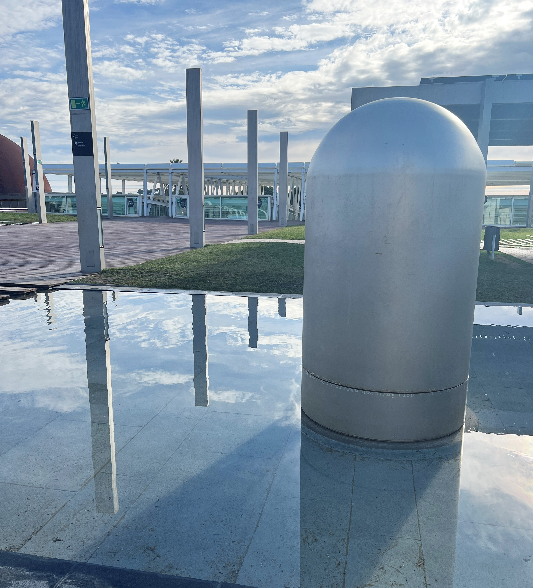

---
hide:
    - toc
---

# Design for the Next Billion Seconds

### Reflection

In the seminar Design for the Next Billion Seconds, we questioned what futures we wanted to remember one billion seconds from now. Some key takeaways that I had from the seminar was reframing what futures are, and how to look at it as a plural meaning of futures, rather than a singular future that we are all trying to get to. That we should view futures as a way for invention and imagination, rather than just prevention. 

We also learned about reframing design as a verb rather than a noun, that design is a practice that helps one make choices. These choices we are designing for are to create change systematically and not just solution-based. A quote that was shared with us by Eduardo Galeano said “I don't believe in charity. I believe in solidarity. Charity is so vertical. It goes from the top to the bottom. Solidarity is horizontal. It respects the other person. I have a lot to learn from other people.” This quote was meaningful to me because traditionally design is seen as a solution-based, top down approach where it can feel disconnected from who you are designing for. It is important to not see design as a sort of ‘charity’ that is just improving things around us, but rather that we are designing in solidarity with the world around us. 

During the week we imagined a day in the life of our future self, one billion seconds away in 2054 and what our day to day would look like –from food, transportation, the news. We also wrote a letter to our current selves, from the perspective of our future self. This writing exercise gave perspective to how short our lives are but also encouragement to do all that I can now, with the resources and privileges around me. It gave perspective that our world is finite and will be a harder place to live, so there is urgency in how we enjoy and preserve it now. 

In learning about critical hope, for a group project we put together a presentation of a time capsule that was opened in 2054 and how our world might look differently if the world around us adopted principles of critical hope and regrowth. Our group thought about how there may be multiple seasons in the future, not just the traditional four. That the seasons would be dictated by things around us that we would need to pay more attention to, such as trees, the tide, and the temperature. We also imagined how education and our relationship with food might be different, and how nature in general would be more precious and integrated into daily life. 

### Group Assignment: Time Capsule Presentation

<iframe src="https://docs.google.com/presentation/d/e/2PACX-1vRh-iCJGii6zHYRcIqGsjryyd88R9pQk-h5pSbr2NkLgoZpnZC-N77cgh8_q4E0TPQ89UbzRO5QHiaq/embed?start=false&loop=false&delayms=3000" frameborder="0" width="960" height="569" allowfullscreen="true" mozallowfullscreen="true" webkitallowfullscreen="true"></iframe>

### Day in My Post-Tech Life 2050s
<iframe src="https://docs.google.com/presentation/d/e/2PACX-1vQrdoA7Stf4ev1p9FYnS7OhFFAhZHeW0iDmm1Tpegtig3nAytwYdZsNzEm-Pl3jQY2e9kfyKCurxo5w/embed?start=false&loop=false&delayms=3000" frameborder="0" width="960" height="569" allowfullscreen="true" mozallowfullscreen="true" webkitallowfullscreen="true"></iframe>

### A Letter from My Future Self

Time Capsule we visited at Museo de la Ciencia CosmoCaixa
