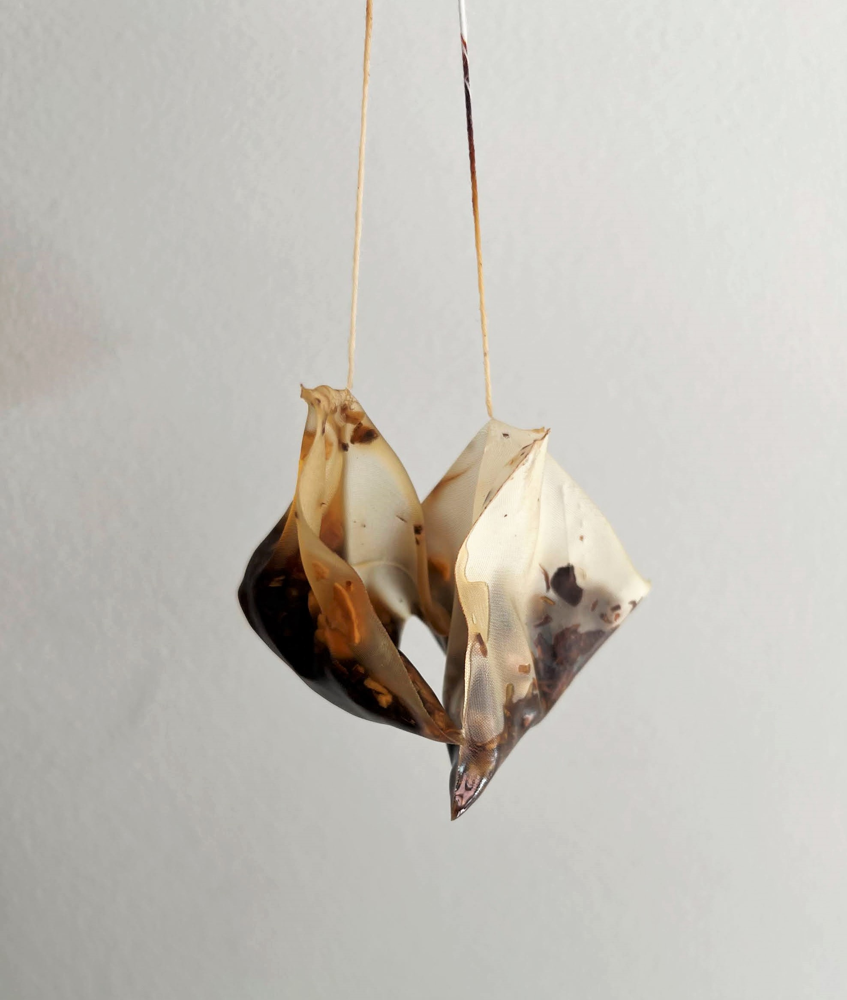
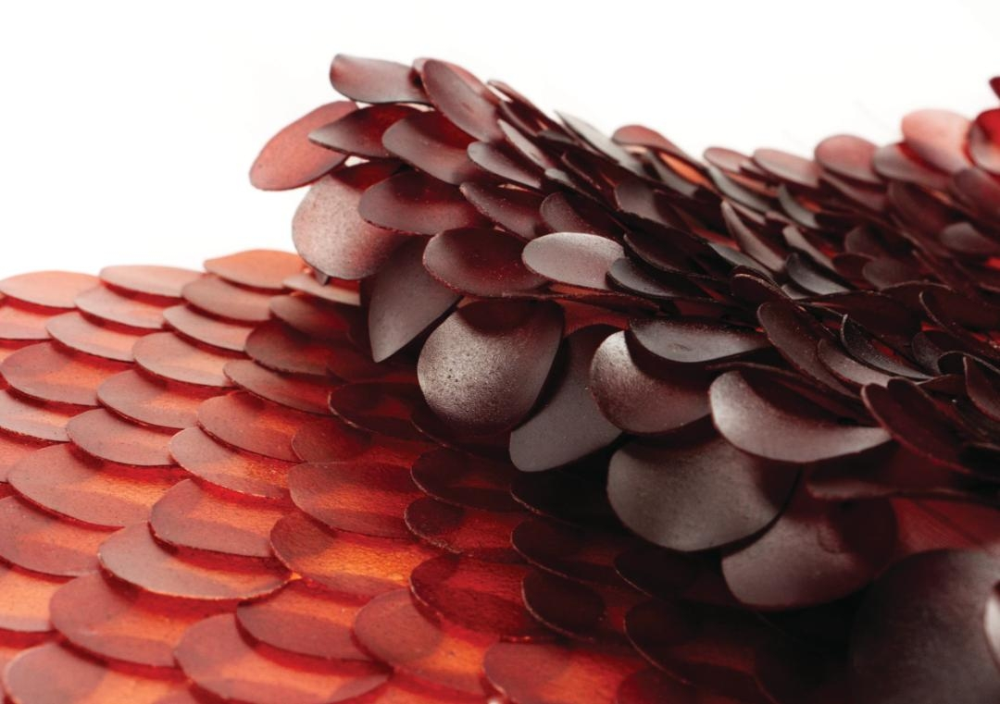
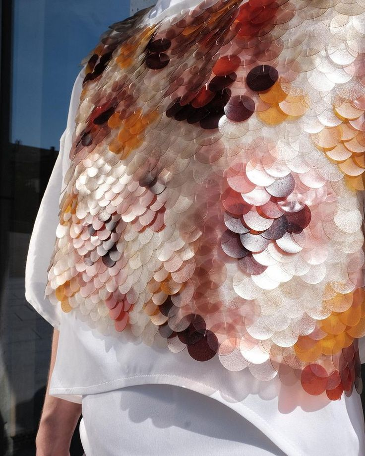
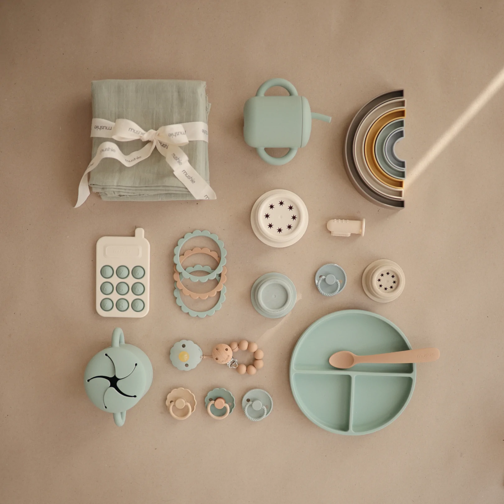

---
hide:
    - toc
---

# Remixing Materials

### Material Narratives

The following is the assignment to look at three materials: one material around me, one from the references in class, and one ideal material. 

**1. Material around me: tea bags**

**Properties:** Nylon, cotton string, resistant to heat, mesh properties, light weight, water resistant. Appears silky and “fancier,” emotions feel more elevated. The shape and material make the item seem like it is offering you a elevated experience for drinking tea. 

**Description:** Mesh bag containing tea leaves, heat sealed together and sealed onto cotton string. This tea bag is designed as a pyramid, which is marketed to be better for tea leaves to brew because of the increased surface area. 

**Story:** Tea bags were invented in 1904 as a more convenient way to drink tea with easy cleanup and single serving purposes. Tea bags today are made from nylon, PET, polypropylene, cotton or paper. Many paper tea bags have a lining of polypropylene inside, making them non-compostable. These paper tea bags are made with thermoplastic fibers in order to make them thermosealing.

Unfortunately, these plastic tea bags casue thousands of microplastics to be in your tea. Microplastics are then ingested and also dumped down drains and into landfills. Most paper filters have plastic and cannot be composted. There is a large misconception that tea bags are biodegradable. Many tea bags are also glued or stapled onto the cotton string, makign those components non-compostable as well. 

Thermosealing paper for tea bags patent shows the combination of paper and plastic fibers woven together: https://patents.google.com/patent/EP0380127A2/en

**Applications:**

- Nylon bags can be heat sealed together to be upcycled for reusable produce bags
- Upcycled thermosealing paper could be used as a textile for artificial plants or flowers

**Reference:** 

https://www.mcgill.ca/newsroom/channels/news/some-plastic-your-tea-300919
https://time.com/3996712/a-brief-history-of-the-tea-bag/

**2. Reference material: Algae sequins by Carolyn Raff**

**Properties:**  Algae agar, cut into sequins for garments and textile, added onto linen-blended materials. These sequins are biodegradable, and have a variety of colors with added natural dyes. It gives emotions of intrigue with the natural but futuristic look of the material with its variety of colors and textures.  

**Description:** The shape and layering of the sequins give depth and movement. The translucent effect gives the sequins a lot of depth, along with the mix of textured and glossy shimmers. 

**Story:** Made by Carolyn Raff, who wanted to use materials from the ocean to show possibilities of what could be made from ocean-based materials. She wanted to make sustainable sequins from a raw material. She used agar because it is readily available, can be manipulated easily, and can be mixed with other colors and materials. 

**Applications:**

- Algae bioplastic sheets could be used for cosmetic packaging
- Algae sequins could be used for home decor like lighting, curtains, decoration

**Reference:** 

https://www.materialsource.co.uk/carolyn-raff-on-biomaterials-sustainable-manufacturing-and-baking-sequins/
https://www.sourcegreen.co/food-packaging/10-seaweed-packaging-startups-algae/

**3. Ideal material: Biodegradable silicone for kid products**

**Properties:** Flexible, waterproof, easy to sterilize/antibacterial, heat resistant, bouncy and durable. Can be made in multiple colors and formed easily into shapes and molds, has similar emotional properties of silicone of feeling healthy and clean. 

**Description:** This material is approachable by kids and parents. It is easy to clean and can be molded into flexible shapes with a variety of colors. 

**Story:** As babies and kids grow up the items around them do not need to last forever, since they are constantly evolving and needing different things. There is a lot of waste in toys and gear for kids, but also a lot of plastic that could be ingested. By having a biomaterial alternative it is healthier for the kids and the environment.

**Applications:**

- Sippy cups or tableware that is easy to clean and and flexible so they are harder to break
- Biodegradable toys, that can be composted when no longer needed or as the kid grows up

### Material Exploration: Floral Waste

As a group we picked floral waste as our local material. We collected discarded flowers and plants from local shops in Eixample and Poblenou. 

  <iframe loading="lazy" style="position: absolute; width: 100%; height: 100%; top: 0; left: 0; border: none; padding: 0;margin: 0;"
    src="https:&#x2F;&#x2F;www.canva.com&#x2F;design&#x2F;DAFZQlGuaa8&#x2F;view?embed" allowfullscreen="allowfullscreen" allow="fullscreen">
  </iframe>

<a href="https:&#x2F;&#x2F;www.canva.com&#x2F;design&#x2F;DAFZQlGuaa8&#x2F;view?utm_content=DAFZQlGuaa8&amp;utm_campaign=designshare&amp;utm_medium=embeds&amp;utm_source=link" target="_blank" rel="noopener">White and Black Minimalist Modelling Portfolio Video Presentation</a> by June Bascaran Bilbao