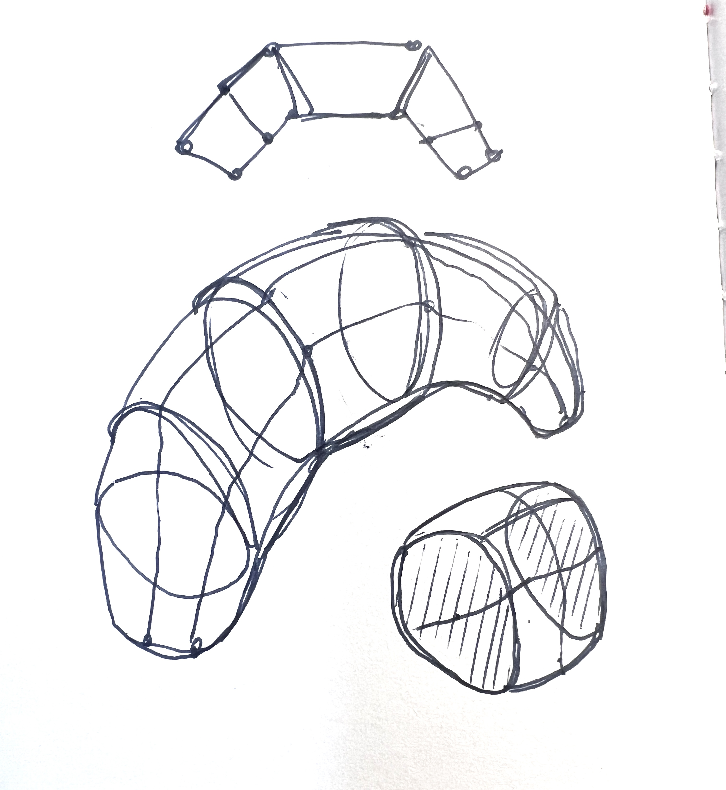
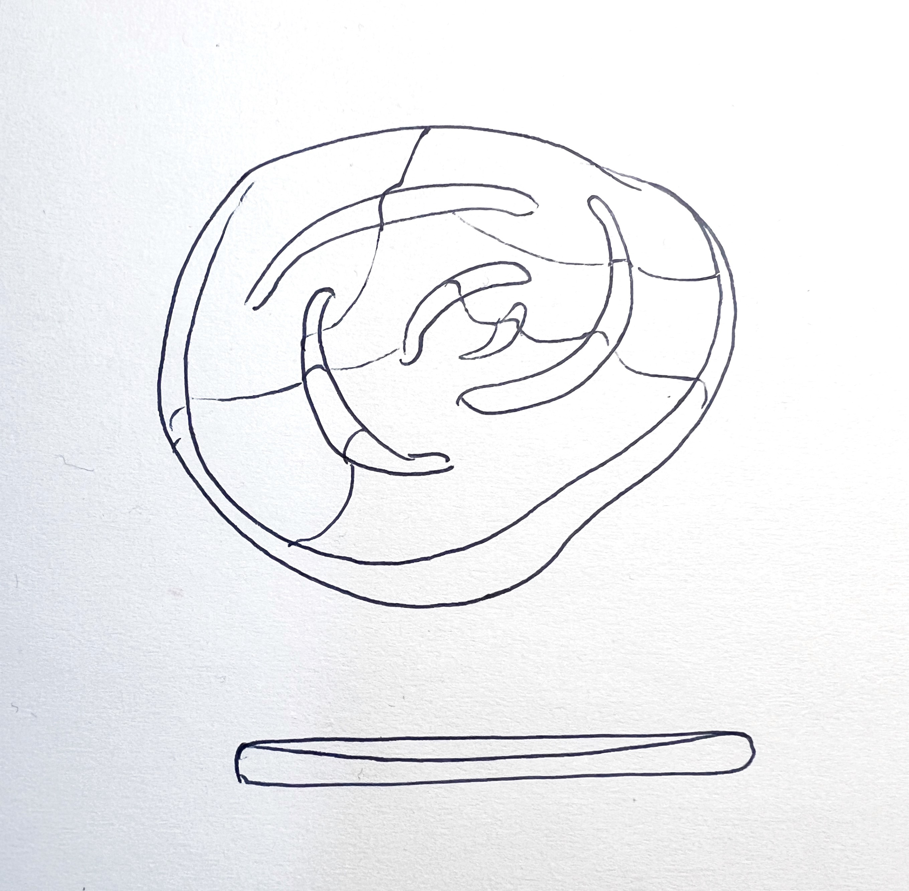
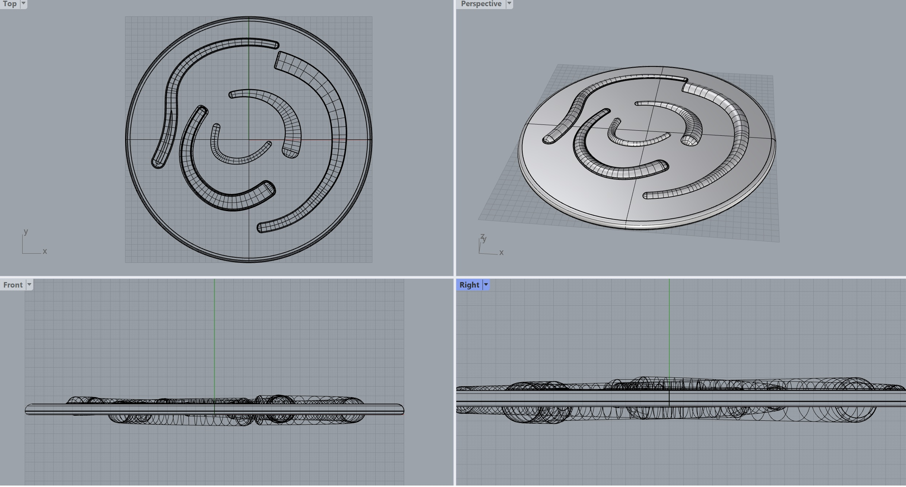

---
hide:
    - toc
---

# Prototyping for Design

## Week 1

### Reflection: Electronics & Coding

During this course we learned about how to approach making a proof of concept using electronic boards. In order to start prototyping, the board is dependent on the size and capacity needed to power the desired functions. It is important to review the datasheet of your microcontroller to make sure that it has the appropriate memory and power. 

The topic of open sourcing was discussed because Arduino is an example of opening up black boxes by making their technology available and shareable. This is through making the software easy to access by beginners, the use of community to contribute and share their knowledge, and the amount of general documentation across multiple languages and platforms for how to use this tool. Open sourcing requires you to also make your work open sourced if you modify the tool itself, however with permissive open source licenses you can use the tool without sharing your own. 

I have not had experience using Arduino or electronics in the past, so for the challenge to produce a song I needed to first understand how to attach the wires and pins to the board. I watched multiple videos and tried to follow diagrams of ESP32 with a buzzer. Once I understood how to follow the diagram and attach the pins it was more clear. 

I was able to follow the ESP32 Feather diagram to hook up the positive to the GND and negative to a designated pin. However, after placing the code for the pacman song into the Arduino, there were many errors and even though I changed the ports it still would not go through. I tested the board on a classmate’s computer to see if it was the wiring on the board or the code and it was able to play their song easily. We played around with which port and board was selected, and eventually got the right combination. I modified the duration and pitch to see how the song would be manipulated. The videos below show the two changes.  
 

Some resources I used:

https://esp32io.com/tutorials/esp32-piezo-buzzer

https://www.circuitbasics.com/how-to-use-active-and-passive-buzzers-on-the-arduino/

https://www.robotique.tech/robotics/control-a-buzzer-by-the-esp32-card/

  <iframe loading="lazy" style="position: absolute; width: 100%; height: 100%; top: 0; left: 0; border: none; padding: 0;margin: 0;"
    src="https:&#x2F;&#x2F;www.canva.com&#x2F;design&#x2F;DAFZuBmHvdk&#x2F;view?embed" allowfullscreen="allowfullscreen" allow="fullscreen">
  </iframe>

### Reflection: 2D, 3D Parametric Design Tools 

Today we learned about the basics of parametric design with 2D and 3D software. The difference between CPU versus GPU and how they relate to the types of image processing needed to run certain programs. CPU allows for heavier mathematical equations and GPU can calculate many small equations. This relates to how vectors and pixels process information as well. Vector can scale without losing definition and is CPU processed, while Pixels are located on a x, y, z grid are GPU processed. Similarly to vectors and pixels, there are mesh versus nurbs, which are also distinguished by the type of processing. Mesh is defined by points and uses polygons, it is mostly used for STL 3D printing files, but is not good for scaling like pixels. Nurbs is used in surface modeling because it allows you to modify smooth and fluid shapes. 

I have a lot of experience in 3D modeling with Solidworks and using Keyshot as a rendering software. I wanted to spend the day learning Rhino because it uses Nurbs and is good for modeling organic shapes. I mainly used Solidworks for surface modeling as well, but it is more difficult to make organic shapes. After using it for the day I realized that Rhino is easy to model quickly, however it is difficult to change past decisions because of the feature tree. There was a plate design with water ripples on it that I was trying to replicate. I worked with Paige to think about the shape we wanted to create, because it is something we found for inspiration for our Bio Deisgn Dinner group who is focusing on making tableware that has water elements. At first I drew the outlines of the ripples, but then found the pipe tool that allowed me to build off of some organic lines. I then added some fillets around the edges after combining the separate pieces. Through this exercise I was able to learn about scaling, fillets, manipulating lines and combining solid geometry. I would like to make another version that can be made into a mold that we can use to fill with biomaterial.

Parametric Croissant 

3D model learning: Rhino

## Week 2

### Reflection: 2D Fabrication (Laser, Vinyl)

Today we learned about Laser and vinyl cutters and the components that make up these machines. A laser cutter is categorized as a CNC machine because it also uses a 3+ axis, and it uses subtractive methods to engrave, mark and cut. We learned about a variety of applications that can be used such as creating living hinges, molds, laminating, and soldering. I am interested in seeing how we can laser cut biomaterials and solder them in order to eliminate glues and stitching. We received a demo for using a vinyl cutter, where we saw an application of it for copper foil to create circuit shapes. Also it can be used as a drawing tool by swapping out the blade for a pen to create computer aided drawings. The cut vinyl can also be used as a simple screen print or masking. 

I decided to make a 2D mold in acrylic for molding biomaterials. Since most biomaterials need non-stick surfaces, I chose this material and a 5mm thickness so that there could be enough height for the mold. The outlined shape will be able to be filled as a mold, and the subtracted negative space can be used as a stencil or stamp. I created the file in Illustrator and for the machine we use Rhino for printing and preparing the file. There was some trouble shooting needed to be able to cut through the material thickness, it needed multiple passes because it was 5mm. Also in order to read the file, the program was having a difficult time reading the lines to cut. Overall we were able to cut successfully and gain more confidence in using Rhino, printing software, and the laser cutter. 

  <iframe loading="lazy" style="position: absolute; width: 100%; height: 100%; top: 0; left: 0; border: none; padding: 0;margin: 0;"
    src="https:&#x2F;&#x2F;www.canva.com&#x2F;design&#x2F;DAFaXpFWVaM&#x2F;view?embed" allowfullscreen="allowfullscreen" allow="fullscreen">
  </iframe>

### Reflection: Inputs & Outputs

  <iframe loading="lazy" style="position: absolute; width: 100%; height: 100%; top: 0; left: 0; border: none; padding: 0;margin: 0;"
    src="https:&#x2F;&#x2F;www.canva.com&#x2F;design&#x2F;DAFaNTcf8iM&#x2F;view?embed" allowfullscreen="allowfullscreen" allow="fullscreen">
  </iframe>

