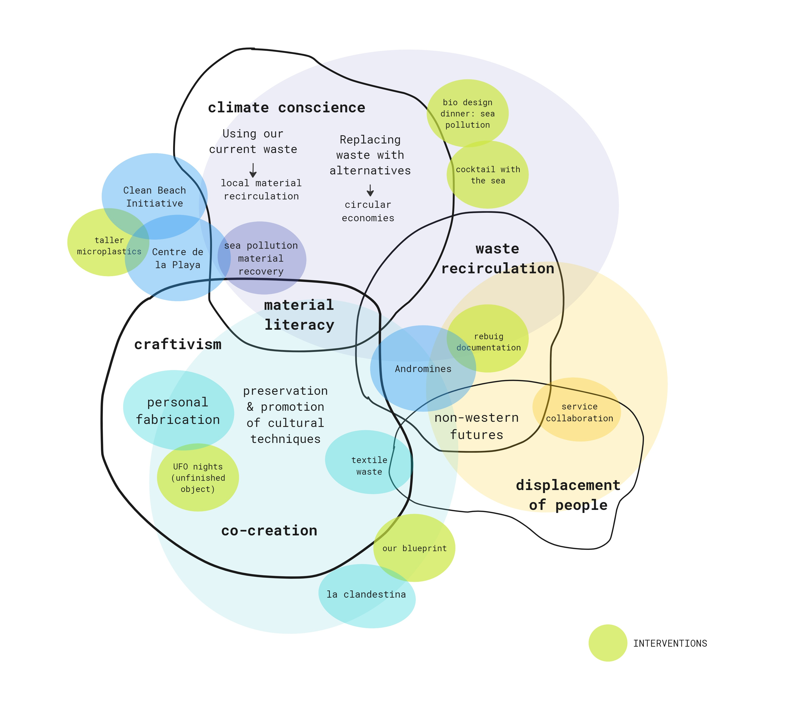

---
hide:
    - toc
---

# Design Studio III

### Intervention Proposals

*Playa x Plastic (Beach Clean)*

From the learnings of last term our proposal for an intervention is to collaborate with Clean Beach Initiative and Centro de la Playa around the topic of microplastics. In this way it would connect two organizations that are working around awareness and facilitating sustainable practices for the local Barcelona beaches. During this intervention we would show the prototype tools we developed to sort and collect microplastics. As well as, conduct a space for brainstorming to hear feedback about the tools, and to show existing litter awareness and tools. We would like this brainstorm to be a time for co-creation with other volunteers and to hear back from them what motivates them to clean the beach, what tools would be helpful, and how could both organizations be supported. It is also a time to bring awareness to microplastics in general and the variety of them that make their way into the Mediterranean. 

*Crafting Community*

We have been building weaving tools from open source designs, and collecting secondhand clothing to use as material. We have also been creating time to share and craft with others to promote non-productive creative spaces and to share knowledge with others. For our proposal, we would like to create an event that offers a community dye bath where community members can bring items they would like to re-fresh and give a new life to. During this event we also would like to have a small panel to talk about textiles and the sources of material. In general the event is to bring awareness to mixed textiles and the issues they are causing, sharing ways to resuse and upcycle, and to create an accessible craft event. 

### Alternative Presents 

*Updated Alternative Presents:*

**Playa x Plastic (Beach Clean)**

Community forms of waste removal such as beach clean ups can be a way to bring awareness to our waste consumption and empower local people to take action. Through working together we can discover and propose alternative futures that work with specific local needs.

Role: Communicating with volunteers and conducting brainstorming for feedback and conversation around beach plastic collection.

**Future Cravings**

Future Cravings is a methodology that makes space for difficult topics to live in a creative and interactive setting. It focuses on a specific climate issue and brings together people from various backgrounds fighting a similar cause. Through creating an immersive experience, Future Cravings provides a space for collaboration and inspiration outside of traditional spaces.

Role: Material development of biomaterials for tableware. Concept creation for proposals and project planning for each iteration.

**Crafting Community**

A space where people can slow down and make together, combating isolation, perfectionism, and honoring traditional methods of making. Empowering people to create things themselves and how to extend the life of our clothing rather than relying on an exploitative system.

Role: Communicating with communities and organizations working with textile waste. Prototype and making of weaving tools and experimentation second hand textiles.

### Ways of Drifting

Jana and Roger lead us in understanding five ways of drifting as a tool to understand how we have progressed through our projects and interests. These five are accumulative, comparative, serial, probing, and expansive. Throughout this masters I was in a comparative and probing state. I started with general interests and topics and continued to find overlapping and connections between interventions and projects. In this way I felt like I was looking at similar ideas from multiple perspectives. In this there were also aspects of probing in experimenting and following down paths as they emerged from one another. In this experimentation I was able to try things and see if I would like to continue down the path or not, shifting back my main interests with new perspectives.

### 5 ways of Scaling

**Crafting Community**

**Why:** To create inclusive spaces for communities to craft together, focused but not constrained to textile and fibers. These spaces are multigenerational and gender inclusive that have a focus on circular economies in how materials are obtained and used in the spaces. 

**What:** Meetups that are community led (Unfinished Object Meetups), workshops, collected online resources and content, open-source resources for diy tool making. 

**Who:** Anyone who is interested in learning crafting, is not limited to socio-economic status or gender. Experts or hobbyists who want to share knowledge. 

**Where:** In local spaces, online sharing, online community, local diy meetups 

**When:** Weekly, monthly

**Type of Structure:** Collective/Network, being connected online in multiple countries but established through small local communities. Amanda and I would like to create a basic structure that people can follow to create their own crafting communities easily. Through an online collective network we can share our findings as a larger community, share resources, and learnings. 

**Future Cravings**

**Why:** Methodology for climate action that brings together an interdisplinary crowd around a specific subject. As a group we explore and develop biomaterial recipes for tableware and create immersive installations. 

**What:** Dinners, exhibits, immersive experiences

**Who:** Designers, artists, charity leads, businesses 

**Where:** Starting in Europe, with possibility to grow globally

**When:** Twice a year or quarterly

**Type of Structure:** Co-op/Collective, under the name of Future Cravings as an entity we invite and can be comissioned for our services. In the future we plan to charge participants a fee for the dinners 
because of the cost of operation. Within this collective we each contribute our skills and roles to it to put on the events together. 

### Updated Design Space III

This is my final design space to end the last term, where categories of interests remained but evolved. Collaborators and organizations that were involved in final interventions of the last two terms have been added alongside the green intervention bubbles. Compared to the end of the second term, waste recirculation and craftivism took on bigger roles as they were central to each project and intervention. From making biomaterial tableware, sorting microplastics, to collecting and upcycling textile waste. Climate conscience and action remained an overarching theme when looking at circular economies and local material recirculation. Material literacy is also added onto this space because the importance of understanding what things are made from and how they are disposed is central to material recirculation and propositions for new uses of waste material. Displacement of people remains part of my space because climate change directly impacts vulnerable populations. It is crucial to look at non-western futures and how it disproportionately affects populations and people through climate crises. Lastly, co-creation as part of craftivism played a key role in my design space and it is how I want to design moving forward. This term for each intervention I tried to be critical about my role as a designer, how I can facilitate with others and listen in order to create possible futures together. 