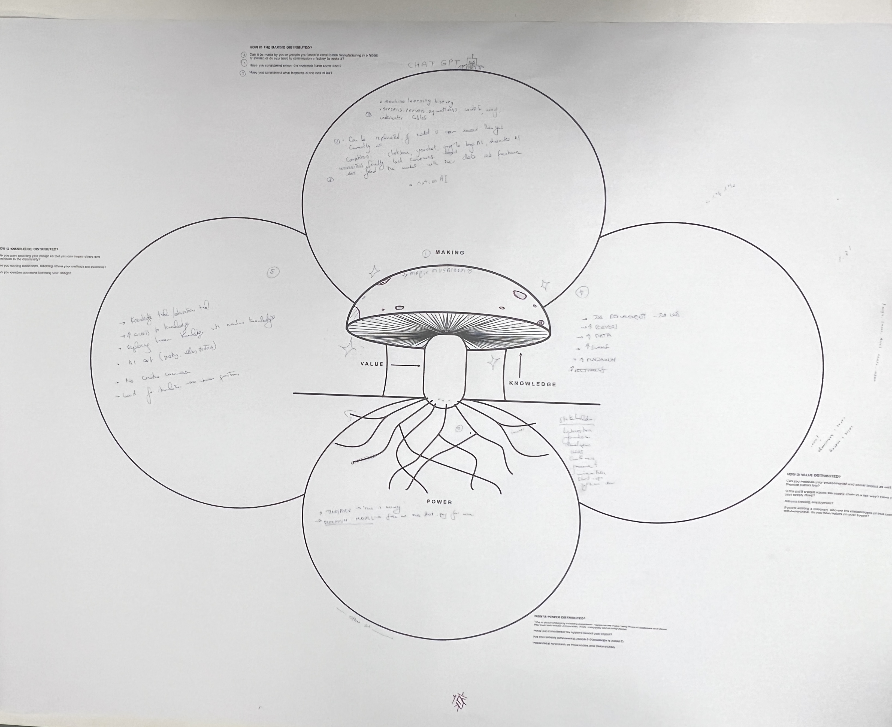

---
hide:
    - toc
---

# Distributed Design

### Reflection 1: Mushroom Model

Our group used the Mushroom Model about ChatGPT as a topic. We started with the making section and worked our way clockwise to answer each section of Making, Knowledge, Power, and Value. 

**Learning Skills:**

*Which skills did I need during the activity and how can I translate into something useful for me and my future?*

For our activity there needed to be some knowledge about ChatGPT in order to contribute to the mushroom model. It also helps to understand current business models, technical terms, current trends, and knowledge of how things are made. Soft skills of listening and adding onto the ideas of others, while encouraging each other to share their opinions in a collaborative way are also important. 

**Dynamics:**

*How was the dynamic inside the group?*

Our group was open to each other's perspective and ideas. We brainstormed together to answer the questions in the model and worked on each section together. Each of us brought our own understanding about ChatGPT, which in itself is an abstract product. Having a variety of perspectives helped to fill out the mushroom model and draw conclusions about ChatGPT in relation of how it can be made, the knowledge needed for it, where the power lies, and what values are held by it. 

**Interactions:**

*Did the role I played influence my opinion?*

Having a more critical view of ChatGPT influenced my perspective and contributions to the discussion. However my role I played was also to listen and ask questions among our team to understand their ideas and perspective. 

### Reflection 2: Reflection Tree

For the reflection tree, I scored myself around the project with Crafting Community with Amanda, and then after we both compared our scores to each other on the same project.

**Learning Skills:**

With this exercise, the skills needed were to understand the values enough to critique my current project being evaluated. It was helpful to have the questions for each value broken down into specifics and to have vocabulary used among the questions to later be used to describe the project's plan to others. After the evaluation, communicating the feelings and opportunities for growth was important in understanding what areas to improve on for the project. In the future using this tool will be helpful when starting new projects and to give vocabulary to describe the values that need to be evaluated or improved. 

**Dynamics:**

Within our group of sharing each person's reflection tree, we were able to each highlight areas we wanted to improve upon. With each topic, we were able to shed light on how they are already achieving this value in a different way then they saw originally. Also it was helpful to see how not all values needed to be prioritized, and that in order to move forward it is good to acknowledge areas of growth but also understand what values were most needed. 

**Interactions:**

It was helpful to evaluate individually and then compare scores of Amanda and I about our same project. This helped to see that we were aligned and we ended up having very similar scores and highlighted areas that we wanted to keep in mind as we moved forward with the project. 

### Reflection 3: Value

This photo is of the collage made by our group that focused on the value of Justice. 

**Learning Skills:**

During this activity, the skills needed were to distill abstract information and to summarize the wide range of perspectives and ideas that came from this activity. For our group this was difficult because justice could be applied in many ways and we spent more time discussing what justice meant to us rather than how it could be measured as a value. We learned new ways of looking at justice and could take the learnings from this discussion to further develop a set of measurables. 

**Dynamics:**

Inside the group we had a good dynamic with lots of sharing and perspectives. We each took turns to talk about what we first thought of when thinking about justice. Whether it was about law, personal experiences with injustices, how to balance forgiveness and accountability, and how justice could be applied to all areas of design. We discovered how grounding justice is in terms of meaning and bringing to light the positive and negatives of projects and their impact. 

**Interactions:**

During our discussion I was listening and reflecting on the ideas brought up from our group and what justice meant to me. As a role I tried to think of ways to synethesize all of the learnings from our group discussion, however we needed more time to summarize. By making a collage, it was helpful to put these abstract concepts into images and texts. My opinion was influenced by the ideas and perspectives brought up during our discussion. 