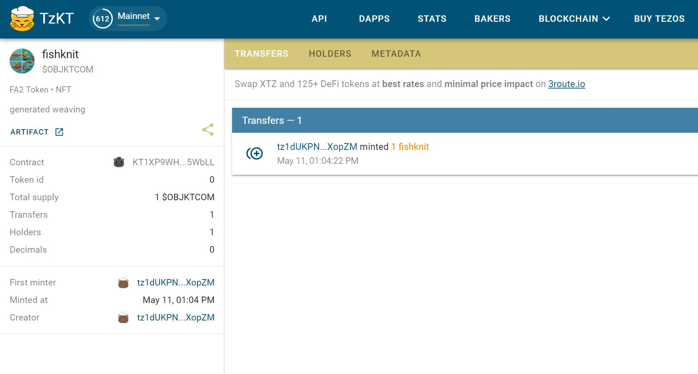

---
hide:
    - toc
---

# Collective Intelligences // Decentralized Autonomous Organizations

### Reflection

Seminar led by Mar Canet

In this class we learned about types of decentralized autonomous organizations (DAOs), blockchains and learned how to set up NFTs. In talking about NFTs and AI generated art, it was an interesting discussion on what it means to actually own something. Also in thinking of the future of marketplaces and art, it was useful to understand the basics of these tools. I think many designers and artists are reluctant to use them and they feel like they will be replaced through these methods. However, understanding how to set them up and approach them gave insight on how they could be another tool for design and art ownership.

Before setting up our NFTs, we first created Temple wallets and used IPFS to set up our own local storage for digital assets. IPFS allows you to store locally and peer to peer, which makes it so your data is not stored on a cloud or someone else's server. We used a cryptocurrency called Tezos, which is an open-source blockchain currency. After making profiles we then set up our own NFT on objkt. For my NFT I created it on hugging face using the text to image AI generator. 

My NFT can be found here:

https://objkt.com/asset/KT1XP9WHZAfN4NRZhbSegfexRsy6VDz5WbLL/0

AI generated art through hugging face:

Setting up NFTs and Tezos 

### Web 3 Project Proposal

Proposal with Amanda for our project Crafting Community

*Initial Ideas:*

- DAO marketplace, co-op for makers/crafters
- Carbon offset credits
    - rewarded to use second hand items 
    - to charge fast fashion companies to purchase textile waste as credits
    - Blockchain to trace to make sure companies aren’t cheating 
- Using photos of the waste– input as a data set to AIi generate images of upcycled designs, to show possible new creations from the waste
    - Alternative of visualizing textile waste 

50% of clothing are not recycled, end up in the landfill or incinerators

30% of clothing produced are never sold
https://www.europarl.europa.eu/RegData/etudes/BRIE/2022/729405/EPRS_BRI(2022)729405_EN.pdf

**Web 3.0 Marketplace Platform for Handmade and Second-hand goods**

If Etsy, Facebook Marketplace, and Craigslist had a baby with Web 3.0

A platform like Mastodon or Mighty Networks that gives creative communities a platform to sell their products. We believe that the marketplaces shouldn’t be owned and dominated by just a few corporations. This platform allows artisans, makers, and small business owners to set up their own community based micro-markets based on interests and affinity groups. Each marketplace is governed by its own unique community cooperative. The platform provides a template as a jumping off point for and structure for listing items and collecting payments.

Within these affinity groups artists can make their own collectives which allows them to share a storefront. This allows for artists starting out or people who want to sell things without having inventory for a whole store to be able to collaborate together with others. With blockchain, the earnings can also be shared securely and quickly among the collectives. 

We mention craigslist because it has stayed true to being a simple and free platform over the years. It also is a platform where users can make what they want of it, and where niche interests and communities can be found. Etsy as a marketplace for handmade goods and vintage finds is also unique in their user base and makes it accessible for anyone to find a specific item.  

For our platform, there are other ideas we would like to incorporate. One would be a place where people could post specific artist or designer needs for a task. This is great as a way to connect artists with customers in a customized and personalized way. It also allows for another stream of revenue for makers. Another idea would be an online flea market where people could stumble or discover artists, makers, and designers as you do when you are walking around a market. This could either be a permanent portion of the platform or designated times of the year. 

Overall we want a platform that supports the makers and artists first. This platform can be a new way to approach the interaction of makers and marketplaces. 

