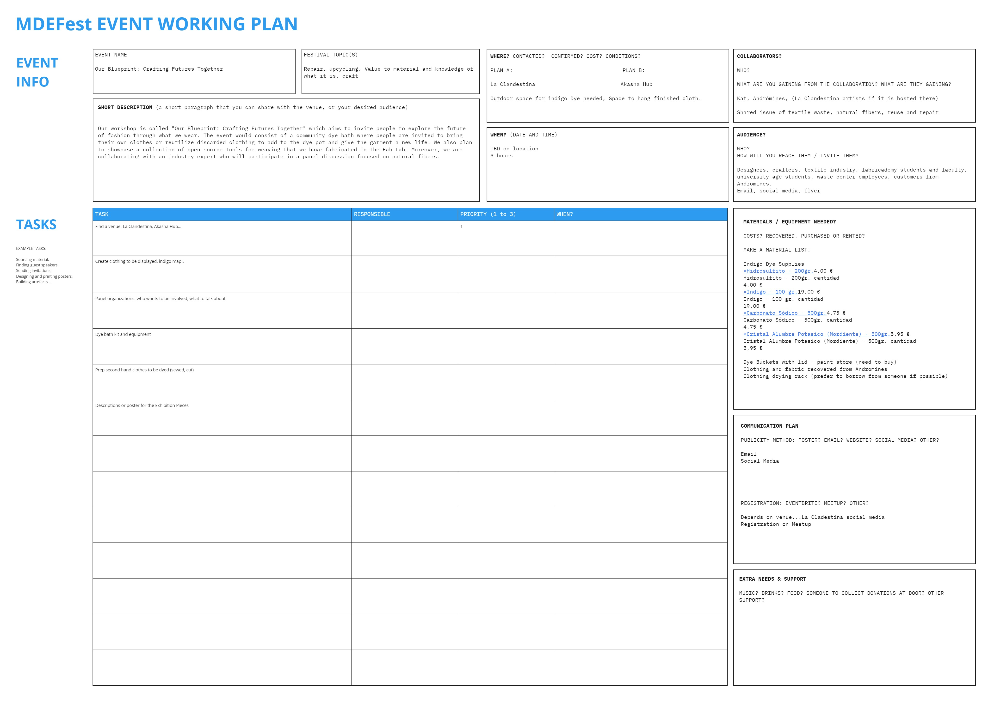
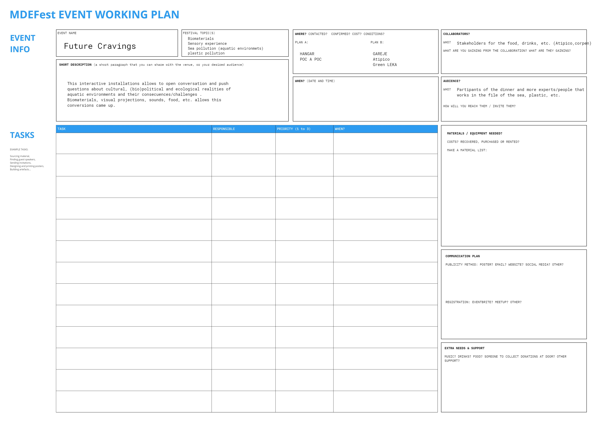
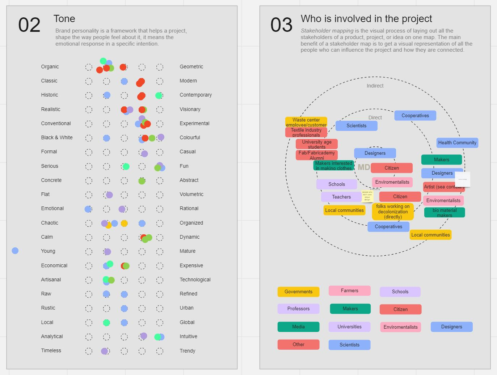

---
hide:
    - toc
---

# MDEFest: No(Body) Knows

### Development of MDEFest

Calendar of festival:
https://fablabbcn.org/calendar/no-body-knows

General development of MDEFest can be seen here:

<iframe width="768" height="432" src="https://miro.com/app/live-embed/uXjVMVMmtdU=/?moveToViewport=-4992,-4535,19815,11554&embedId=155946128217" frameborder="0" scrolling="no" allow="fullscreen; clipboard-read; clipboard-write" allowfullscreen></iframe>

### Working Plan

Julia and Audrey led us through exercises to describe the goals, tasks, and needs for our interventions as we were developing them. This form was helpful to pin down next steps, location, and description on our intervention. 

For Crafting Community / Our Bluprint we developed a project working plan here:

For Future Cravings our project working plan is here:

### Collective Branding

The communications team led us in exercises to come up with a cohesive brand language for the festival. This was difficult because all of our projects have different focuses, but through their exercises we were able to make some decisions together. It was helpful to see the tools they used to lead us through this design exercise as a whole and their facilitation. In the end we were able to come to a consensus even though it was difficult to decide together.

After this exercise, Manu created two directions of branding and showed us how she created artwork through text to image AI generator (dreamlike). She showed us the process of how she created the artwork from a combination of prompts and inspiration images. 

Collective Branding Exercise:

